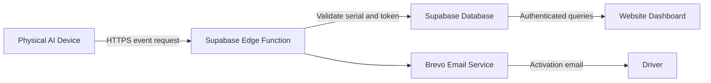

# Driver Fatigue Monitoring System

I developed this project as a professional web platform for a physical Driver Fatigue Monitoring System. The system is designed around a real AI detection device, not a browser-based model. The physical device contains the camera, runs the fatigue detection model locally, and sends only the final detection results to the backend.

The website is a dashboard and administration platform. It does not run the AI model, does not access the camera, and does not perform inference in the browser.

```text
Physical Device -> Supabase Edge Function -> Supabase Database -> Website Dashboard
```

## Project Purpose

The goal of this system is to monitor driver fatigue events in a secure and organized way. The physical device detects driver states such as `Awake`, `Drowsy`, and `Yawn`. When a fatigue-related event is detected, the device sends the event to a Supabase Edge Function through HTTPS. The backend validates the device serial number and device token, stores the event in the database, and the website dashboard displays the live status, analytics, logs, and reports.

This project is suitable as a graduation project prototype and as a production-style proof of concept for a connected safety monitoring platform.

## Live Website

Target GitHub Pages project name:

```text
driver-fatigue-monitoring-system.github.io
```

Important GitHub Pages note:

- If the repository is created under my normal GitHub account, the website URL will be similar to:

```text
https://MY_GITHUB_USERNAME.github.io/driver-fatigue-monitoring-system.github.io/
```

- To get this exact root URL:

```text
https://driver-fatigue-monitoring-system.github.io/
```

the GitHub user or organization must be named:

```text
driver-fatigue-monitoring-system
```

## Main Features

- Responsive driver dashboard for laptop, tablet, and mobile browsers.
- Driver login using email address and permanent unique device serial number.
- Live device monitoring with status indicators:
  - Green for `Awake`
  - Red for `Drowsy`
  - Orange for `Yawn`
- Latest event timestamp and confidence score.
- Current session counters.
- Optional latest camera frame preview when `frame_url` is sent.
- Analytics charts for fatigue events.
- Event history table.
- CSV and Excel log export.
- Admin dashboard for fleet/device management.
- Device activation workflow with Brevo email integration.
- Supabase database schema and Row Level Security policies.
- Supabase Edge Function endpoint for physical device event ingestion.
- Secure separation between frontend public keys and backend secret keys.

## System Architecture



The physical AI device is responsible for camera input and model inference. The backend is responsible for validation, storage, and email activation. The website is responsible for displaying the already-detected results.

## Technology Stack

- Frontend: HTML, CSS, JavaScript
- Charts: Chart.js
- Excel export: SheetJS
- Backend: Supabase Edge Functions
- Database: Supabase PostgreSQL
- Authentication:
  - Drivers: email address + permanent device serial number
  - Admins: Supabase Auth + admin role in `profiles`
- Email service: Brevo
- Deployment: GitHub Pages
- Physical device communication: HTTPS POST requests to Supabase Edge Function

## Project Structure

```text
driver-fatigue-platform/
├── .github/
│   └── workflows/
│       └── pages.yml
├── supabase/
│   ├── schema.sql
│   └── functions/
│       ├── _shared/
│       ├── admin-activate-device/
│       ├── admin-device-action/
│       ├── device-events/
│       └── driver-login/
├── app.js
├── config.example.js
├── config.js
├── index.html
├── styles.css
├── .gitignore
├── .nojekyll
└── README.md
```

## Database Design

The main database tables are:

### `drivers`

Stores driver information.

- `id`
- `name`
- `email`
- `created_at`

### `devices`

Stores the physical device record and links it to one driver.

- `id`
- `serial_number`
- `device_token_hash`
- `driver_id`
- `activated_at`
- `status`
- `created_at`

The raw device token is not stored in the database. Only the hashed token is saved.

### `detection_logs`

Stores fatigue events sent by the physical device.

- `id`
- `device_id`
- `driver_id`
- `timestamp`
- `event_type`
- `confidence`
- `status`
- `frame_url`
- `session_id`
- `created_at`

### `driving_sessions`

Stores optional driving session summaries.

- `id`
- `driver_id`
- `device_id`
- `started_at`
- `ended_at`
- `total_drowsy_events`
- `total_yawn_events`

### `profiles`

Stores Supabase Auth user roles for administrators.

- `id`
- `email`
- `role`

## Driver Access

Drivers access the dashboard using:

```text
Email address
Permanent unique device serial number
```

The serial number is sent to the driver by email during device activation. The driver can use the same email and serial number to access the dashboard in the future.

## Admin Workflow

The administrator can:

- Register a new physical device.
- Generate a permanent unique serial number.
- Assign a device to a driver email.
- Send an activation email through Brevo.
- View all devices and their status.
- Disable a device.
- Reset a device token.
- View driver logs and fleet analytics.

When a device is activated:

1. I enter the driver name and email in the admin dashboard.
2. The backend creates or updates the driver record.
3. The backend generates or stores a permanent serial number.
4. The backend generates a device token.
5. The backend stores only the hashed device token.
6. Brevo sends the serial number to the driver by email.
7. The raw device token is shown to the admin once.
8. The device token is installed on the physical AI device.

The driver receives only the serial number, not the device token.

## Physical Device Security

The physical device stores only:

```text
device_serial
device_token
```

The physical device must never store:

```text
SUPABASE_SERVICE_ROLE_KEY
BREVO_API_KEY
APP_JWT_SECRET
DEVICE_TOKEN_PEPPER
```

The physical device communicates only with:

```text
POST https://PROJECT_REF.supabase.co/functions/v1/device-events
```

The device does not access the database directly.

## Device Event API

Endpoint:

```text
POST https://PROJECT_REF.supabase.co/functions/v1/device-events
```

Example request:

```json
{
  "device_serial": "DFMS-8H42K9",
  "device_token": "secret_device_token",
  "timestamp": "2026-05-11T14:20:00Z",
  "event_type": "Drowsy",
  "confidence": 0.91,
  "status": "Drowsy",
  "frame_url": "optional-image-url",
  "session_id": "optional-session-id"
}
```

The Edge Function validates:

- Device serial number exists.
- Device token matches the stored hash.
- Device status is active.
- Device is assigned to a driver.

If validation succeeds, the event is inserted into `detection_logs`.

## Supabase Setup

1. Create a Supabase project.
2. Open the Supabase SQL Editor.
3. Run:

```text
supabase/schema.sql
```

4. Create an admin user in Supabase Auth.
5. Copy the admin user's UUID.
6. Promote the user to admin:

```sql
insert into public.profiles (id, email, role)
values ('PASTE_ADMIN_USER_UUID_HERE', 'admin-email@example.com', 'admin')
on conflict (id) do update
set role = 'admin', email = excluded.email;
```

## Supabase Edge Function Deployment

From the project folder:

```bash
npx supabase link --project-ref YOUR_PROJECT_REF
```

Deploy the device and driver-login functions without JWT verification because they perform their own validation:

```bash
npx supabase functions deploy device-events --no-verify-jwt
npx supabase functions deploy driver-login --no-verify-jwt
```

Deploy admin functions normally:

```bash
npx supabase functions deploy admin-activate-device
npx supabase functions deploy admin-device-action
```

## Supabase Secrets

Set backend secrets using the Supabase CLI:

```bash
npx supabase secrets set APP_JWT_SECRET="YOUR_SUPABASE_JWT_SECRET"
npx supabase secrets set DEVICE_TOKEN_PEPPER="LONG_RANDOM_PEPPER"
npx supabase secrets set BREVO_API_KEY="YOUR_BREVO_API_KEY"
npx supabase secrets set BREVO_SENDER_EMAIL="verified-sender@example.com"
npx supabase secrets set BREVO_SENDER_NAME="Driver Fatigue Monitoring System"
npx supabase secrets set DASHBOARD_LOGIN_URL="https://your-github-pages-url/"
```

I do not place backend secrets in frontend code.

## Frontend Configuration

The frontend uses only public Supabase values in `config.js`.

```js
window.DFMS_CONFIG = {
  SUPABASE_URL: "https://YOUR_PROJECT_REF.supabase.co",
  SUPABASE_ANON_KEY: "YOUR_SUPABASE_ANON_OR_PUBLISHABLE_KEY",
  FUNCTIONS_BASE_URL: "https://YOUR_PROJECT_REF.supabase.co/functions/v1",
  DASHBOARD_LOGIN_URL: window.location.origin + window.location.pathname,
  DEMO_MODE: false
};
```

The anon or publishable key is safe for browser use when Row Level Security is enabled correctly. The service role key must never be used in the website.

## Brevo Email Activation

Brevo is used from the backend only. When the admin activates a device, the backend sends an email to the driver containing:

- Driver name
- Permanent device serial number
- Dashboard login link
- Basic activation instructions

The raw device token is not emailed to the driver. It is shown to the admin once and should be installed on the physical device.

## Row Level Security

The system uses Supabase Row Level Security to protect data:

- Drivers can read only their own data.
- Admin users can manage all drivers, devices, and logs.
- Devices cannot directly read or write database tables.
- Devices can only submit events through the Edge Function.
- Backend functions use secret keys only in the Supabase server environment.

## GitHub Pages Deployment

This project includes a GitHub Actions workflow:

```text
.github/workflows/pages.yml
```

The workflow publishes only the static website files to GitHub Pages:

- `index.html`
- `styles.css`
- `app.js`
- `config.js`
- `config.example.js`
- `README.md`
- `.nojekyll`

To deploy:

1. Create a GitHub repository named:

```text
driver-fatigue-monitoring-system.github.io
```

2. Push this project to the `main` branch.
3. Open the GitHub repository.
4. Go to **Settings** -> **Pages**.
5. Set **Source** to **GitHub Actions**.
6. Wait for the `Deploy static dashboard to GitHub Pages` workflow to finish.
7. Open the GitHub Pages URL.

After deployment, update the Supabase secret:

```bash
npx supabase secrets set DASHBOARD_LOGIN_URL="https://YOUR_FINAL_GITHUB_PAGES_URL/"
```

Then redeploy the activation function if needed:

```bash
npx supabase functions deploy admin-activate-device
```

## Physical Device Guide

The physical device should run the detection model locally. When the model detects `Drowsy` or `Yawn`, it should send the event to the Edge Function.

Example device environment:

```bash
DFMS_DEVICE_SERIAL="DFMS-8H42K9"
DFMS_DEVICE_TOKEN="DEVICE_TOKEN_FROM_ADMIN"
DFMS_EVENT_COOLDOWN="5"
```

The device event sender should use HTTPS and should never include database service keys.

## Security Notes

- The website contains only public frontend values.
- The Supabase service role key is backend-only.
- The Brevo API key is backend-only.
- Device tokens are hashed before storage.
- Each device has a unique permanent serial number.
- Each serial number is assigned to one driver email.
- Drivers use only their email and serial number to access their dashboard.
- The browser does not run the fatigue detection model.

## Local Testing

Run a local static server:

```bash
python -m http.server 8080
```

Open:

```text
http://127.0.0.1:8080
```

Driver access requires a driver and active device record in Supabase.

Admin access requires:

- A Supabase Auth user.
- A matching row in `profiles`.
- `role = 'admin'`.

## Final Notes

I built this platform to demonstrate a complete connected safety monitoring system:

```text
AI Physical Device -> Secure Backend -> Database -> Professional Dashboard
```

The most important design decision is that the AI detection runs on the physical device. The web platform receives, verifies, stores, and visualizes the detection results in a secure way.
